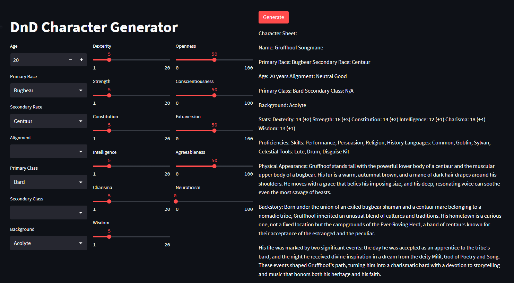

# Storywriter

Storywriter is a creative writing tool that leverages the power of language models to unleash your creativity. Storywriter presents users with the limitless abilities of AI generated content by providing a simple interface that directly exposes all possibilities.

# Getting Started Using Storywriter

Before generating content, you must add your OpenAI API key to the app. The key should by entered in **widgets/openai_generation_widget.py**. Please be careful not to share your private key with others.

To use a content generator, simply navigate to the correct generators page, select your customization options, and press generate.

# Getting started developing with Storywriter

Expanding Storywriters conten generators is as simple as creating a new page for the generaters in the **pages** folder. Use one of the other generators as a template to see how the UI is bound to the language models.

# Screenshots

